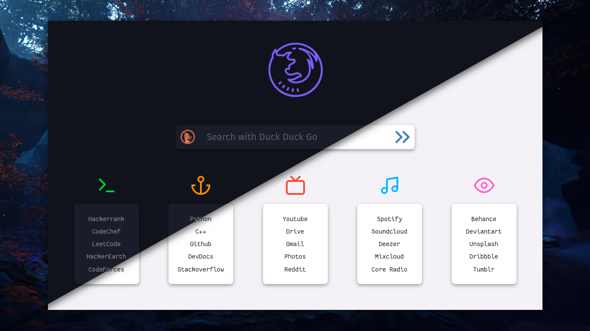
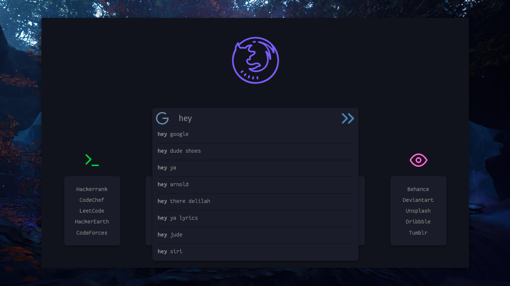
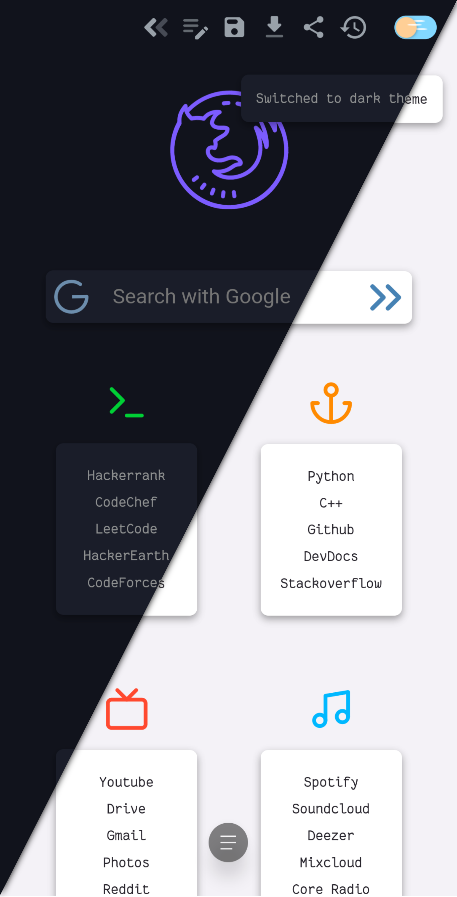

# Prism

A minimalist, beautiful startpage forked from [Prismatic Night](https://github.com/3r3bu5x9/Prismatic-Night)

<h3 align="center">Google Suggestions</h3>

<h3 align="center">Responsive</h3>

# Features

- [x] Dark/Light theme (Switch button in right pane)

- [x] Google autocomplete suggestion

- [x] Responsive

- [x] Some hover drop shadows

- [x] Popups based on activities

- [x] User settings for editing links

  - Click `Edit` button to edit the links
  - Links will be in edit mode now
  - Press `Enter` in input box after editing link
  - Click `Save` to save the links

- [x] Import/Export/Restore links

- [ ] Option to add more links to a Container

- [ ] Option to add more Containers

- [ ] Time widget
