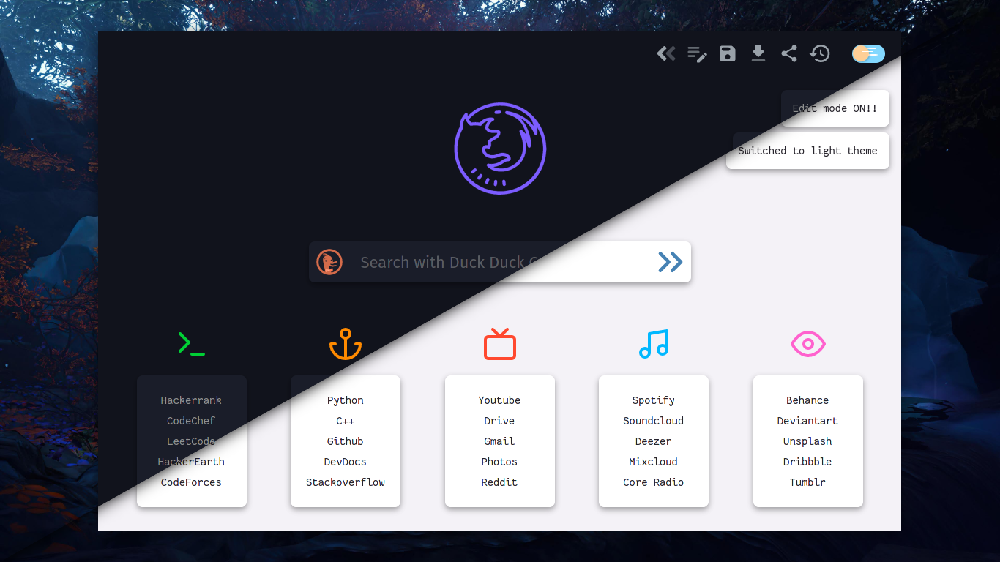

# Prism

A minimalist, beautiful startpage forked from [Prismatic Night](https://github.com/3r3bu5x9/Prismatic-Night)

<h3 align="center">Google Suggestions</h3>

<h3 align="center">Responsive</h3>

Extra Features:

1) Dark/Light theme (Switchs according to system theme)
2) Google autocomplete suggestion
3) Responsive
4) Some hover drop shadows

